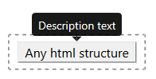
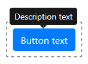
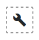

# React bootstrap tools

**Please note**: This project is under start-up process. Inconsistencies, fails or any collapses are highly possible until project will reach v. 1.0.0 stepstone.

[](https://github.com/LukaszNowakPL/react-bootstrap-tools/blob/master/LICENSE)
[](https://www.npmjs.com/package/react-bootstrap-tools)
[](https://www.npmjs.com/package/react-bootstrap-tools)
[](https://travis-ci.org/LukaszNowakPL/react-bootstrap-tools)
[](https://david-dm.org/LukaszNowakPL/react-bootstrap-tools)
[](https://david-dm.org/LukaszNowakPL/react-bootstrap-tools?type=dev)
[](https://github.com/prettier/prettier)
[](https://codeclimate.com/github/LukaszNowakPL/react-bootstrap-tools/maintainability)
[](https://codeclimate.com/github/LukaszNowakPL/react-bootstrap-tools/test_coverage)

React bootstrap tools are bundle of tools build on top of [react-bootstap](https://github.com/react-bootstrap/react-bootstrap) components. They are customisable components ready to use on any webpage.

Package contains:
* [`DescribedComponent`](#describedcomponent) to describe given html element using Tooltip
* [`DescribedButton`](#describedbutton) to describe Button using Tooltip
* [`Glyphicon`](#glyhicon) to provide Material icon

## Installation

Install dependency on your project

```
npm install react-bootstrap-tools
```

Import package to your component

```
import { DescribedComponent, DescrbedButton, Glyphicon } from "react-bootstrap-tools";
```

Use it directly on your component

```
<DescribedComponent description="description text">
    <p>html element</p>
</DescribedComponent>
```

React bootstrap tools does not ship with any particular styling.
In order to provide Bootstap's default stylesheet attach it onto `head` section of your `html` document.
Check more info [here](https://react-bootstrap.github.io/getting-started/introduction#stylesheets)

```
<link rel="stylesheet" href="https://stackpath.bootstrapcdn.com/bootstrap/4.2.1/css/bootstrap.min.css" integrity="sha384-GJzZqFGwb1QTTN6wy59ffF1BuGJpLSa9DkKMp0DgiMDm4iYMj70gZWKYbI706tWS" crossorigin="anonymous">
```

Also if you use `Glyphicon` component, in order to see graphical icons attach icons definition onto `head` section of your `html` document.
Check more info [here](https://google.github.io/material-design-icons/)

```
<link href="https://fonts.googleapis.com/icon?family=Material+Icons" rel="stylesheet">
```

## Usage

Workable examples are available on sub-folders of `src/lib/examples/` folder. You can import those examples directly to demo application ([see Development section](#development) below).

### DescribedComponent

Wrapper for describing given html portion using Bootstrap's `Tooltip` component.



#### Example of usage

```
import React from 'react';
import { DescribedComponent } from 'react-bootstrap-tools';

const SimplestExample = () => (
    <DescribedComponent description="description text">
        <p>html element</p>
    </DescribedComponent>
);

export default SimplestExample;
```

#### Available optional props

* string `description` : Description text to put inside `Tooltip` component
* string `className` : Additional class name to custom your styling of a `Tooltip` component.
Styling example for `NewStyle`:<pre>
.NewStyle > .tooltip-inner {
    background-color: yellow;
    color: black;
}
.NewStyle.bs-tooltip-top .arrow::before {
    border-top-color: yellow !important;
}
.NewStyle.bs-tooltip-right .arrow::before {
    border-right-color: yellow !important;
}
.NewStyle.bs-tooltip-bottom .arrow::before {
    border-bottom-color: yellow !important;
}
.NewStyle.bs-tooltip-left .arrow::before {
    border-left-color: yellow !important;
}</pre>
* string `placement` : Position of a `Tooltip` over component it describes.<br />
Available options:
    * auto-start
    * auto
    * auto-end
    * top-start
    * top
    * top-end
    * right-start
    * right
    * right-end
    * bottom-end
    * bottom
    * bottom-start
    * left-end
    * left
    * left-start
* number `delay` : Number of milliseconds the `Tooltip` component will appear and hide after describing component hover.
* boolean `defaultShow` : Set `true` will initialise component with visible description
* string `trigger` : Action necessary to take over component to initialise visibility of description.<br />
Available options:
    * hover
    * click
    * focus
    * Array<hover, click, focus>

### DescribedButton

Wrapper for describing Bootstrap's `Button` using `Tooltip` component. It also handles click actions, auto activation/disabling of button as well as simulates `href` link behaviour.



#### Example of usage

```
import React from 'react';
import { DescribedButton } from 'react-bootstrap-tools';

const SimplestExample = () => (
    <DescribedButton description="description text" text="button text" />
);

export default SimplestExample;
```

#### Available optional props

* string `description` : Description text to put inside `Tooltip` component
* string `text` : Text visible on button
* string `icon` : Material icon id. If used together with `text` prop, icon will appear on the left hand side of text provided. Click [here](https://material.io/tools/icons/?style=baseline) to check available icons library.<br />
Additional props connected with `icon` prop:
    * string `iconClassName` : Additional class name to custom your styling of provided icon
* string `className` : Additional class name to custom your styling of a `Tooltip` component.
Styling example for `NewStyle` value:<pre>
.NewStyle > .tooltip-inner {
    background-color: yellow;
    color: black;
}
.NewStyle.bs-tooltip-top .arrow::before {
    border-top-color: yellow !important;
}
.NewStyle.bs-tooltip-right .arrow::before {
    border-right-color: yellow !important;
}
.NewStyle.bs-tooltip-bottom .arrow::before {
    border-bottom-color: yellow !important;
}
.NewStyle.bs-tooltip-left .arrow::before {
    border-left-color: yellow !important;
}</pre>
* string `buttonClassName` : Additional class name to custom your styling of button
* string `placement` : Position of a `Tooltip` over button.<br />
Available options:
    * auto-start
    * auto
    * auto-end
    * top-start
    * top
    * top-end
    * right-start
    * right
    * right-end
    * bottom-end
    * bottom
    * bottom-start
    * left-end
    * left
    * left-start
* number `delay` : Number of milliseconds the `Tooltip` component will appear and hide after button hover.
* boolean `defaultShow` : Set `true` will initialise button with visible description
* string `trigger` : Action necessary to take over button to initialise visibility of description.<br />
Available options:
    * hover
    * click
    * focus
    * Array<hover, click, focus>
* string `id` : Id property of rendered button
* string `name` : Name property of rendered button
* string `type` : Type property of rendered button.<br />
Available options:
    * button
    * reset
    * submit
* boolean `active` : Set `true` will show button in visual `active` mode (same as it was activated by trigger action)
* boolean `block` : Set `true` will create block level buttons. It will span the full width of a parent
* boolean `disabled` : Set `true` will disable the button. This way the `onClick` action will not initialise
* string `href` : If on use, button will work as usual link directing to prop's url<br />
Additiona props connected with `href` prop:
    * boolean `hrefNewWindow` : Set `true` will open `href` url on new window<br />
* string `size` : Bootstrap's size property of a button.<br />
Available options:
    * sm
    * lg
* string `variant` : Bootstrap's variant property of a button.<br />
Available options: 
    * primary
    * secondary
    * success
    * danger
    * warning
    * info
    * dark
    * light
    * link
    * outline-primary
    * outline-secondary
    * outline-success
    * outline-danger
    * outline-warning
    * outline-info
    * outline-dark
    * outline-light
* callback `onClick` : Callback function taken during click on button. The callback will receive `event` object that initiated the call.<pre>const onClickCallback = event => { /*callback definition\*/ }</pre><br />
Additional props connected with `onClick` prop:
    * any `onClickArg` : If on use, `callback` function will additionally receive this prop's data.<br /><pre>const onClickCallback = (customArg, event) => { /\*callback definition\*/ }</pre>This option is vital for better performance in terms of avoiding the unnecessary re-render of a component.<br />**Note** prop available only with `onClick` prop 

### Glyphicon

Component for rendering [Material icon](https://material.io/tools/icons/?style=baseline).



#### Example of usage

```
import React from 'react';
import { Glyphicon } from 'react-bootstrap-tools';

const SimplestExample = () => (
    <Glyphicon icon="add" />
);

export default SimplestExample;
```

#### Available props

* string `icon` Material icon id. Click [here](https://material.io/tools/icons/?style=baseline) to check available icons library.

#### Available optional props

* string `className` Additional class name to custom your styling of an icon.
Styling example for `NewStyle` value:<pre>
.NewStyle {
    background-color: yellow;
    color: red;
}</pre>

## Contribution

Got ideas on how to make those components better? Open an issue under [on GitHub bugtracker](https://github.com/LukaszNowakPL/react-bootstrap-tools/issues).

## Development

Clone repo

````
git clone https://github.com/LukaszNowakPL/react-bootstrap-tools.git
````

Install all dependencies

```
npm install
```

Start development server

```
npm start
```

Check hot reloading preview

```
http://localhost:3000/
``` 

Development server uses Demo app stored on `src/demo/index.tsx`. You can import any of examples stored on sub-folders of `src/lib/examples/` folder.
You'll find commented option how to preview `BasicExample` of each component on `src/demo/App.tsx` file.

### Folder structure

Package is based on [create-react-library](https://github.com/DimiMikadze/create-react-library) and implements it's concept of file structure.

Live demo files are stored on `src/demo` folder. You can manipulate components and their props on `App.tsx` file.

Developed components are stored on `src/lib/components` folder. Component's files should be encapsulated in one folder together:
* `/__tests__` folder for automatic `Jest` tests of given component
    * `__snapshots__` for storing snapshots created by `__tests__/renders.js` file
    * `functions.test.js` for Unit tests of functions inside `functions.ts` file
    * `integration.test.js` for integration tests of given component (cooperation with other components)
    * `renders.js` for rendering snapshots of component on different states
* `/gfx` folder for any images used by component
* `config.ts` for configuration data of given component
* `functions.ts` for logic functions
* `index.tsx` for main component file
* `interfaces.ts` for Type Script interfaces
* `style.scss` for component's style sheet

**Note**: Depending on component structure some files (i.e. `config.ts`, `functions.ts` or `__tests__/integration.test.js`) are not necessary on the package.

### Examples

Example files are stored on sub-folders of `src/lib/examples` folder. Example components should be as simple as possible, returning only example container, some short description of an example, as well as Component formed to achieve given example's idea. Please attach as many valuable examples as possible.

### Importing components

`src/lib/index.js` is a gate for providing package components. If you add new one to the package please import it to this file and also make it available to package users by exporting it. Components not exported by this file are not visible for package end users. Any import of developed package (including those on demo app and examples) should take place from `src/lib/index.js` file.

### 3rd party packages

If you attach any 3rd party package please mention it on `dependency` section of your `package.json` file
as well as on `module.export.externals` of your `config/webpack.config.prod.js` file.

package.json
```
{
  "dependencies": {
    "react-bootstrap": "^1.0.0-beta.3"
  },
}
```

config/webpack.config.prod.js
```
module.exports = {
    externals: {
        react: 'react',
        'react-dom': 'react-dom',
        'react-bootstrap': 'react-bootstrap',
    }
}
```

Avoiding to do so will end up on breaking down the application that consumes your component, even if the package has build and published successfully.

### Technologies

Components are written on [TypeScript](https://www.typescriptlang.org/). However you may write new ones using `Jsx` or older versions of JS.
Package is based on [create-react-library](https://github.com/DimiMikadze/create-react-library) which is a library based on ejected <a href="https://facebook.github.io/create-react-app/" target="_blank">create-react-app</a> tailored to writing new `NPM` modules.
Package consumes [Sass](http://sass-lang.com/) and [Jest](https://jestjs.io/) frontend test environment.

### Testing

To fire up `Jest` test 

```
npm run test
```

To fire up `Jest` tests with included Coverage report (stored under `coverage/` folder and available as an html document under `coverage/lcov-report/index.html` file)

```
npm run test-with-coverage
```
 
### Build library

```
npm run build
```

Produces production version of library under the `build` folder.

### Publish library

```
npm publish
```

## Thanks

To all authors of packages used to build this one and contributors. Special props goes to:
* [create-react-library](https://github.com/DimiMikadze/create-react-library)
* [react-bootstrap](https://github.com/react-bootstrap/react-bootstrap)
