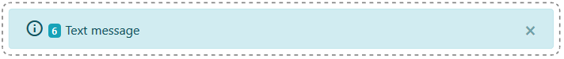

# AlertBox

Component for presenting short info.



## Example of usage

```
import React from 'react';
import { AlertBox } from 'react-bootstrap-tools';
import "react-bootstrap-tools/build/static/css/index.css";

const SimplestExample = () => (
    <AlertBox variant='warning' message='warning message content' />
);

export default SimplestExample;
```

## Available props

- string | HtmlElement `message` : Message to show inside the box. It may be textual message as well as any html component.

## Available optional props

- string `id` : Prop to identify inside group of same components.
- boolean `dismissible` : Flag if component should contain `close` button.
  Additional props connected with `dismissible` prop:
  - string `closeLabel` : Label shown as a `title` during hovering on `close` button
- string `variant` : Bootstrap's variant property of an alert.<br />
  Available options:
  - primary
  - secondary
  - success
  - danger
  - warning
  - info
  - dark
  - light
- string | true `withIcon` : Flag if component should contain an additional material icon to decorate the message.
  Available values:
  - boolean : If set `true`, type of material icon will be computed using `variant` value
  - string : Material icon id. Click [here](https://material.io/tools/icons/?style=baseline) to check available icons library.
    Additional props connected with `withIcon` prop:
  - string `iconClassName` : Additional class name to custom your styling of provided icon
- number `waitingItems` : If on use, component will be decorated with a `Badge` component to present the prop's value. This prop is useful with multiple information popped at the same time and therefore bundled into a group in order to not to cover an application UI. You can easy bundle components up using `AlertBoxGroup` component.
- string `className` : Additional class name to custom your styling of a component.
- boolean `withCollapse` : Flag if component should be wrapped with Bootstrap's `Collapse` component. If not set (or false) component is wrapped using Bootstrap's `Fade` component.
- number `hideAfter` : Number of milliseconds the component should start hiding after it's been fully entered.
- callback `onEnter` : Callback function fired when component started to show. It passes string `id` arg.
- callback `onEntering` : Callback function fired when component is showing up. It passes string `id` arg.
- callback `onEntered` : Callback function fired when component has fully shown up. It passes string `id` arg.
- callback `onExit` : Callback function fired when component started to hide. It passes string `id` arg.
- callback `onExiting` : Callback function fired when component is hiding. It passes string `id` arg.
- callback `onExited` : Callback function fired when component is fully hidden. It passes string `id` arg.

## Styling

The component exposes `AlertBox__wrapper` class attached to it's wrapper. Use example code below to manipulate component's position to suit your needs

```
.AlertBox__wrapper {
  position: absolute;
  width: 100%;
  padding: 4px 10%;
  top: 25px;
}
```

The component exposes `AlertBox__icon` and `AlertBox__badge` classes to manipulate icon and badge styling.
To avoid itches on vertical-align between elements and text message use those classes together with shipped stylesheet.

```
import "react-bootstrap-tools/build/static/css/index.css";
```

If you use component with `withIcon` prop don't forget to attach Material icon stylings

```
<link href="https://fonts.googleapis.com/icon?family=Material+Icons" rel="stylesheet">
```