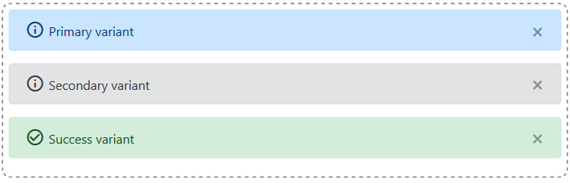

# AlertBoxGroup

Component for grouping AlertBox components.



## Example of usage

```
import React from 'react';
import { AlertBoxGroup } from 'react-bootstrap-tools';
import "react-bootstrap-tools/build/static/css/index.css";

const alerts = [{
    variant: 'warning', message: 'warning message content'
}];

const SimplestExample = () => (
    <AlertBoxGroup alerts={alerts} />
);

export default SimplestExample;
```

## Available props

- array `alerts` : Array of objects to pass directly as `AlertBox` prop.
It's important that each object will have a unique `id` prop. This will help you to identify object on after actions (i.e. `onExited` callback).

## Available optional props

- number `maxAlerts` : Maximum amount of parallel `AlertBox` components to show. Otherwise components will collapse in a group.

## Styling

Should you have any question please read `Styling` section of `AlertBox` component readme.

## State and actions management

The aim of `AlertBox` component is to present short info available for some time period.
For example to inform user the data has been saved or Api action failed.
On React world it means the `AlertBox` component should be encapsulated in one place and managed by some state which is changing during lifetime of an application.
This sounds like a perfect place for `Redux` store manager or `Context` api of React itself.
It's up to developer to manage the state as React bootstap tools does not ship with any of mentioned proposals.
Nevertheless the package expose few utils to help you with state management.
Please find `ReduxExample` and `ContextExample` inside `src/lib/examples/AlertBoxGroup` folder to see how you can manage state by exposed utils.

### Immutability discussion

In general it's a good practice to use `immutable` objects across store managers.
Nevertheless alerts are small and short lived portions of information so to gain simplicity and save on computation, the utilities below consume only basic mutable objects.
If you use any immutable library, please convert passed `alerts` arrays `asMutable`.

### addAlert

Utility to manage addition of new alert.

```
addAlert = (alerts: array, alert: object) => newAlerts: array
```

#### Example of usage

```
import { addAlert } from 'react-bootstrap-tools';

const alerts = [{
    id: '1234',
    variant: 'warning',
    message: 'warning message content'
}];

const alertToAdd = {
    variant: 'info',
    message: 'new message'
}

const newAlerts = addAlert(alerts, alertToAdd);

// now newAlerts is an array of two objects
// Please note each alert has it's own unique id
```

## Available props

- array `alerts` : Array of objects. They should be pass directly as `AlertBox` prop.
It's important that each object will have a unique `id` prop. This will help you to identify object on after actions (i.e. `onExited` callback).
- object `alert` : Object pass directly as `AlertBox` prop. **Note**: The object will automatically get it's own id based on moment it's been invoked.


### dismissAlert

Utility to manage erasure of an alert.

```
dismissAlert = (alerts: array, id: string) => newAlerts: array
```

#### Example of usage

```
import { dismissAlert } from 'react-bootstrap-tools';

const alerts = [{
    id: '1234',
    variant: 'warning',
    message: 'warning message content'
}];

const emptyAlerts = dismissAlert(alerts, '1234');

// now newAlerts is an empty array
```

## Available props

- array `alerts` : Array of objects. They should be pass directly as `AlertBox` prop.
It's important that each object will have a unique `id` prop. This will help you to identify object using `dismissAlert` utility.
- string `id` : Value of `id` property of alert which should be deleted from memory as unneeded.
