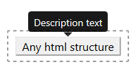

# DescribedComponent

Wrapper for describing given html portion using Bootstrap's `Tooltip` component.



## Example of usage

```
import React from 'react';
import { DescribedComponent } from 'react-bootstrap-tools';

const SimplestExample = () => (
    <DescribedComponent description="description text">
        <p>html element</p>
    </DescribedComponent>
);

export default SimplestExample;
```

## Available optional props

- string `description` : Description text to put inside `Tooltip` component
- string `className` : Additional class name to custom your styling of a `Tooltip` component.
  Styling example for `NewStyle`:<pre>
  .NewStyle > .tooltip-inner {
  background-color: yellow;
  color: black;
  }
  .NewStyle.bs-tooltip-top .arrow::before {
  border-top-color: yellow !important;
  }
  .NewStyle.bs-tooltip-right .arrow::before {
  border-right-color: yellow !important;
  }
  .NewStyle.bs-tooltip-bottom .arrow::before {
  border-bottom-color: yellow !important;
  }
  .NewStyle.bs-tooltip-left .arrow::before {
  border-left-color: yellow !important;
  }</pre>
- string `placement` : Position of a `Tooltip` over component it describes.<br />
  Available options:
  - auto-start
  - auto
  - auto-end
  - top-start
  - top
  - top-end
  - right-start
  - right
  - right-end
  - bottom-end
  - bottom
  - bottom-start
  - left-end
  - left
  - left-start
- number `delay` : Number of milliseconds the `Tooltip` component will appear and hide after describing component hover.
- boolean `defaultShow` : Set `true` will initialise component with visible description
- string `trigger` : Action necessary to take over component to initialise visibility of description.<br />
  Available options:
  - hover
  - click
  - focus
  - Array<hover, click, focus>
